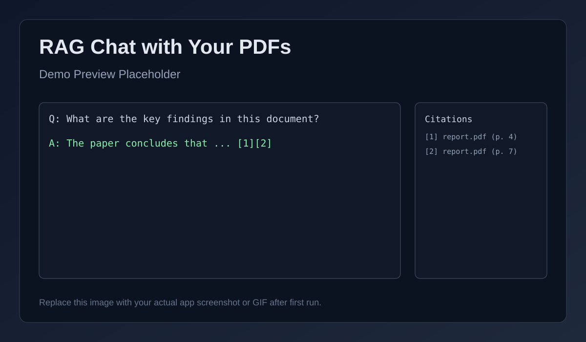

# RAG Chat with Your PDFs

A lightweight Retrieval-Augmented Generation (RAG) app that lets you:

- Upload PDF files
- Build embeddings + FAISS vector index
- Ask questions and get answers with source citations
- Keep chat history across multiple questions in one session

## Demo



Tip: replace this with a real screenshot or GIF after running the app.

## Suggested GitHub Topics

`rag` `pdf-chat` `streamlit` `faiss` `sentence-transformers` `openai` `retrieval-augmented-generation` `nlp` `aiml-project`

## Tech Stack

- Streamlit (UI)
- PyPDF (text extraction)
- Sentence Transformers (`all-MiniLM-L6-v2`) for embeddings
- FAISS (vector similarity search)
- OpenAI API (optional answer synthesis)
- Ollama (free local model inference)

## What's New in V2

- Hybrid ranking: semantic similarity + lexical overlap
- Diversity-aware citation selection (avoids repeating same page)
- Session chat history and one-click clear history

## Project Structure

```text
rag-pdf-chat/
|- app.py
|- requirements.txt
|- LICENSE
|- .gitignore
|- assets/
|  |- demo-placeholder.svg
|- rag_core/
|  |- config.py
|  |- pdf_utils.py
|  |- chunking.py
|  |- vector_store.py
|  `- qa.py
|- data/
|  `- uploads/
`- storage/
```

## Quickstart

1. Create and activate a virtual environment:

```powershell
python -m venv .venv
.\.venv\Scripts\Activate.ps1
```

2. Install dependencies:

```powershell
pip install -r requirements.txt
```

3. Choose one answer backend:

Option A: Ollama (free, local, recommended)

```powershell
ollama pull llama3.2:3b
ollama serve
```

Option B: OpenAI API

```powershell
$env:OPENAI_API_KEY="your_api_key_here"
```

4. Run app:

```powershell
streamlit run app.py
```

5. In the app:
- Upload PDFs
- Click `Save Uploaded PDFs`
- Click `Build Index`
- Ask questions

## Notes

- Without `OPENAI_API_KEY`, the app still works and returns relevant cited excerpts.
- Sidebar `Answer Mode` supports `ollama`, `openai`, and `local`.
- Built index is stored in `storage/` and ignored in git.
- License: MIT

## Web Scraping PDF Demo Questions

Use these prompts after loading `Web Scraping.pdf`:

1. What is web scraping, and what problem does it solve?
2. Which libraries are mentioned (`requests`, `BeautifulSoup`, `Selenium`), and what is each used for?
3. What is the difference between downloading HTML and parsing HTML?
4. What is the purpose of HTTP headers like `User-Agent` in scraping?
5. Why is `try-except` important in scraping scripts?
6. What common errors can happen during scraping, and how can we handle them?
7. When should we use Selenium instead of `requests + BeautifulSoup`?
8. What are the key steps in a complete scraping workflow from URL to final dataset?
9. What practices help avoid getting blocked by websites?
10. What legal and ethical points should be considered before scraping a site?
11. How can we extract links, tables, and text fields from a page?
12. Summarize this PDF in 8 bullet points with citations.
